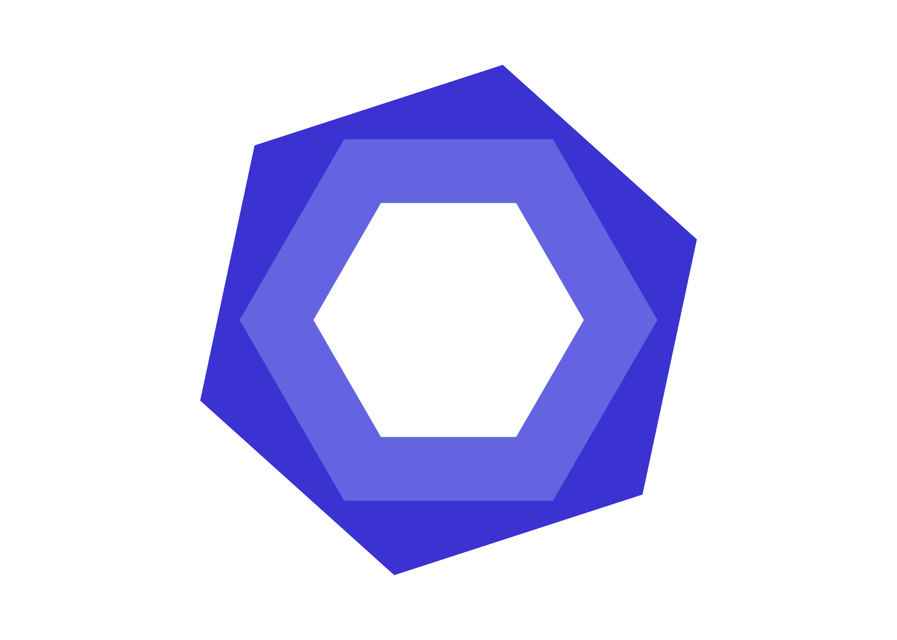
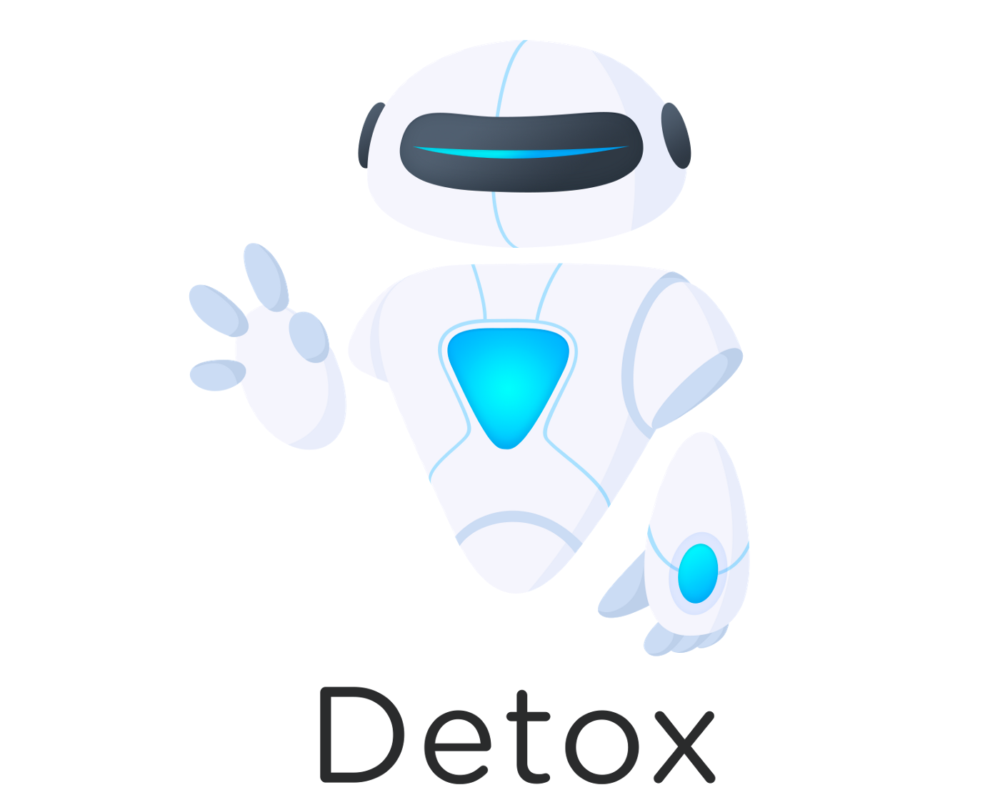

<h3>Languagues</h3>

 

  
   

 

<h3>Databases</h3>

 

  
  

 

<h3>Front-end</h3>

 

  
  
  

 

<h3>Back-end</h3>

 

  
  
  

 

<h3>Tools</h3>

 

  
  
  
  
  
  
  

 

<h3>Testing</h3>

 

  
  
  
  
  

 

<h2>Currently learning</h2>

 

  
  
  
  

 

<h2>Interest in learning</h2>

 

  
  

 

