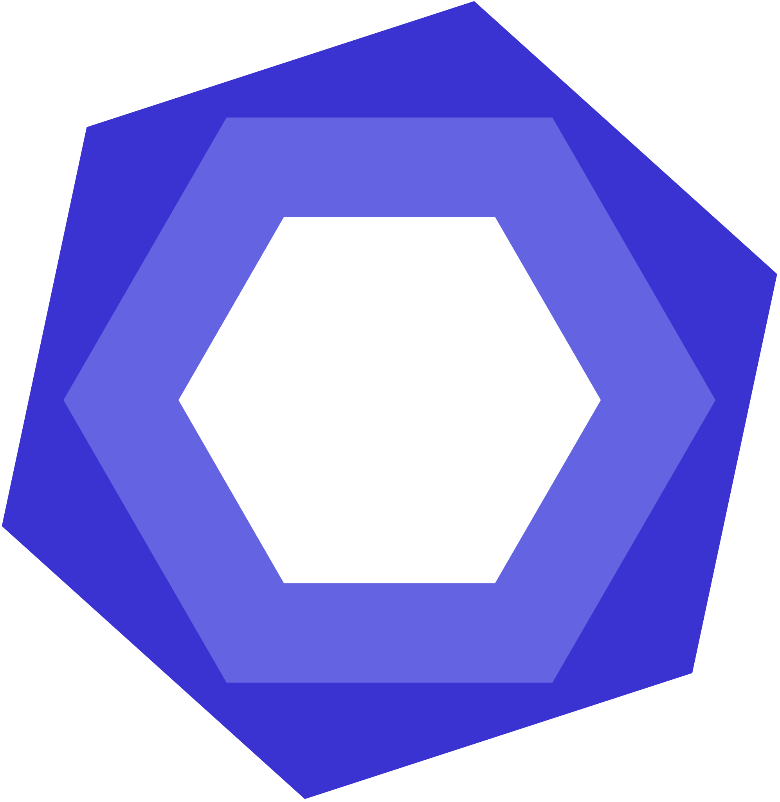

 

<h3>About me</h3>

- 🕸️ | Web dev with React & Next.js

- 📱 | Mobile dev with React Native & Expo

- 💻 | Code Editor: VSCode

- 📋 | ESLint & [Prettier](https://gist.github.com/itispx/f44821732bda322e988e4fbed146aa55) are my best friends

 

---

<table>

<tr align="center">
<td>Typescript</td>
<td>Javascript</td>
<td>Java</td>
<td>React</td>
<td>React Native</td>
<td>Expo</td>
</tr>

<tr align="center">
<td height="50px"></td>
<td height="50px"></td>
<td height="50px"></td>
<td height="50px"></td>
<td height="50px"></td>
<td height="50px"></td>
</tr>

<tr align="center">
<td>Android</td>
<td>Node.js</td>
<td>MongoDB</td>
<td>MySQL</td>
<td>Firebase</td>
<td>Spring</td>
</tr>

<tr align="center">
<td height="50px"></td>
<td height="50px"></td>
<td height="50px"></td>
<td height="50px"></td>
<td height="50px"></td>
<td height="50px"></td>
</tr>

<tr align="center">
<td><a target="_blank" rel="noreferrer" href="https://itispx.github.io/git-cheat-sheet/">Git</a></td>
<td>ESLint</td>
<td>Redux</td>
<td>Express</td>
<td>Next.js</td>
<td>Sass</td>
</tr>

<tr align="center">
<td height="50px"></td>
<td height="50px"></td>
<td height="50px"></td>
<td height="50px"></td>
<td height="50px"></td>
<td height="50px"></td>
</tr>

<tr align="center">
<td>Jest</td>
<td>Detox</td>
<td>Mocha</td>
<td>Chai</td>
<td>Postman</td>
<td>Insomnia</td>
</tr>

<tr align="center">
<td height="50px"></td>
<td height="50px"></td>
<td height="50px"></td>
<td height="50px"></td>
<td height="50px"></td>
<td height="50px"></td>
</tr>

<tr align="center">
<td>Thunder Client</td>
</tr>

<tr align="center">
<td height="50px"></td>
</tr>

</table>

---

 

